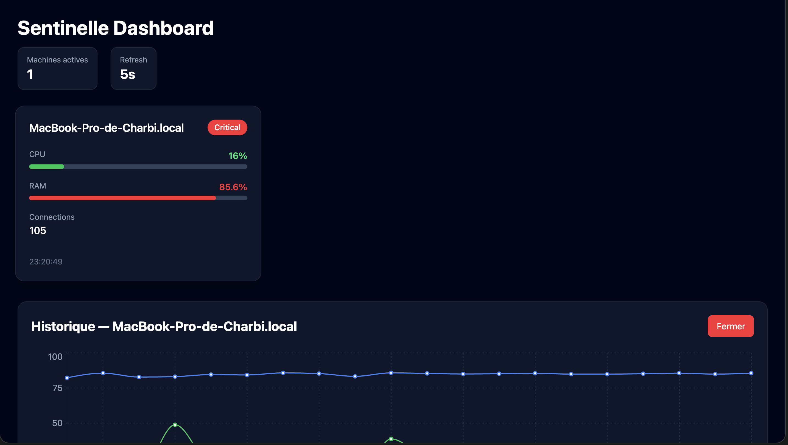
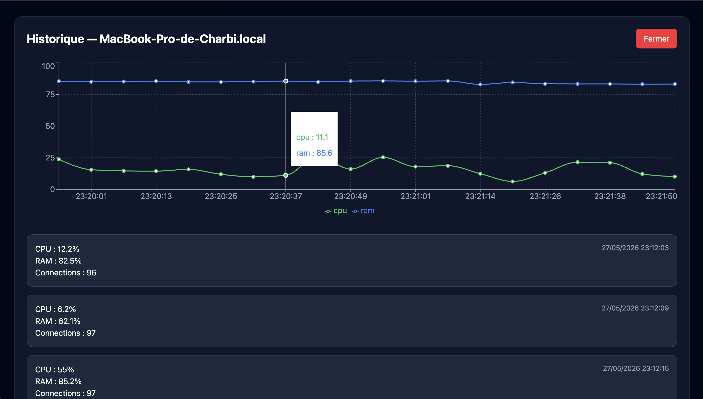

# Sentinelle

Sentinelle est un projet de monitoring système en temps réel développé avec FastAPI, React et PostgreSQL.

Le projet permet de superviser plusieurs machines grâce à un agent léger qui collecte des métriques système et les envoie vers une API centralisée.

---

## Fonctionnalités

* Monitoring CPU
* Monitoring RAM
* Nombre de connexions réseau
* Statut online / offline des machines
* Historique des métriques
* Dashboard temps réel
* Architecture Docker complète

---

## Stack technique

### Backend

* FastAPI
* SQLAlchemy
* PostgreSQL
* psutil

### Frontend

* React
* Vite
* TailwindCSS

### Infrastructure

* Docker
* Docker Compose

---

## Architecture

* Agent local → collecte les métriques système
* Backend FastAPI → reçoit et stocke les données
* PostgreSQL → persistance des métriques
* Frontend React → dashboard temps réel

---

## Installation

### Cloner le projet

```bash
git clone https://github.com/mcharbi00/sentinelle.git

cd sentinelle
```

---

## Lancement avec Docker

```bash
docker compose up --build
```

---

## Lancer l’agent

Ouvrir un second terminal :

```bash
cd backend

source venv/bin/activate

python app/agent/agent.py
```

---

## Accès

### Frontend

```text
http://localhost:5173
```

### Backend

```text
http://localhost:8000
```

### Swagger

```text
http://localhost:8000/docs
```

---

## Captures d’écran
    
### Dashboard principal




---

